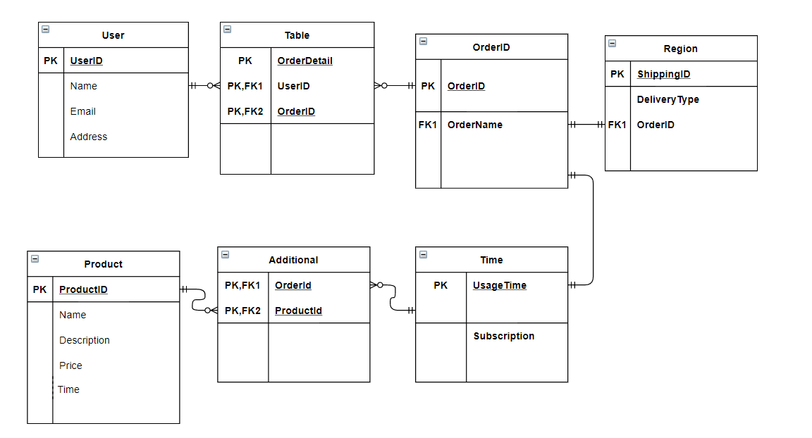

 

# **T2A1 Workbook by Muhammed Tayyeb Khan**

**Q1 - Describe the architecture of a typical Rails application (208 words)**

***Answer***

The architecture of a typical rails application uses something known as the MVC. This is also known as the Model, View and Controller pattern that allows simpler accessibility throughout your application.

**Model** – This layer acts as the logic of your application, controlling the data with a set of rules, and manages the interactions with its relatable elements. The model also appropriates validations as well as represents the information in the database.

**View** – This is the front-end of the application, which the user sees as its interface. HTML files and CSS is what is used to embed Ruby code in rails. This display of data to the user is in the format of views, which are used to provide the data to the browers that requested the web pages. Views is not limited to HTML, but other formats such as PDF, RSS or XML etc.

**Controller** – The controller acts with both the model and the view, as a ‘neural network’, relating the incoming requests from say the browsers, which is then processed by the controller, then alows the data from the models to pass it to the views leading to its display to the user.

 

*Reference*

https://www.sitepoint.com/model-view-controller-mvc-architecture-rails/

 
 

**Q2 - Identify a database management system (DBMS) commonly used in web applications (including Rails) and discuss the pros and cons of this database (236 words)**

***Answer***

One of the most common and popular database used is SQLite. By default, when you create an application on Ruby on Rails, SQLite will install.  

**Pros** 

SQLite is considered to be lightweight in databases which means that it is easy to use, as well as easy to embedd software such a TVs, mobile phones, cameras, as well as financial analysis tools, and edititing suites. 

Installation is not required by Ruby on Rails, as it comes set to default for any application you start in rails that leads to increased accessibility.

Performance of SQLite is quite fast in reading and writing of operations for a database and the loading of data is faster due to it not needed to read through everything and keep it all in its memory.

Portability of SQLite is also a great feature as working on machines with 32-bit or 64-bit can lead to compatibility issues with other databases as well as its functionality with all programming languages to date.

**Cons**

 The biggest drawback I see in SQLite is its lack of multi-user operations. Meaning, when compared to PostgreSQL, it lacks secruity beyond encryption of the database itself.  

Another disadvantage is the restricted size of being 2GB in most cases, which can be a massive disadvantage for larger projects with a lot of data needed that will leave the user losing all the pros available in SQLlite.

 

*Reference*

https://sqlite.org/whentouse.html

 
 

**Q3 - Discuss the implementation of Agile project management methodology (329 words)**

***Answer***

Agile is a project management methodology that is designed to handle complex and modern projects in a nutshell. It allows flexibility in the development process and is able to also take and change requests from the clients whilst building the project. With this concept in mind, no project objective is set in stone from the beginning as the client requirements for the project are worked on in incremental and interactive cycles.

To help understand better understand the general principles of the agile method I will break it down:

- Keeping the client satisfied at all times whilst developing their software is a general rule of statement.

- Defining a clear business vision that the project you are building will help address the reason why, as well as a point to return back to as you build.

- If and when requirements need to be changed they should be interpreted as a competitive advantage for the clients, meaning they want an advantage in the market.

- The delivery of software should be frequent towards the client as it helps a developer keep on track with a clients need as well as decreasing the time of delivery.

- Communication should usually be face to face as it’s the best way to transfer and explain information to and from teams as well as clients.

- Working software is a measurement of progress yet if it isn’t in line with the initial plan, make sure that all requirements were met and keep this habit in mind.

- Sponsors, users and developers should be able to maintain a pace that is sustainable, using daily standups to make sure no roadblocks are creeping up in completing goals in a timely fashion.

- Simplicity is key, self-organized and self-motivated teams will create better products.

- For Agile project management to work, having clear steps one after the other will determine better outcomes in the length of the project. Once a feature is completed and shown, it’s mandatory to decide what needs to be done next.

 

*Reference*

https://www.apm.org.uk/resources/find-a-resource/agile-project-management/

 
 

**Q4 - Provide an overview and description of a standard source control process (113 words)**

***Answer***

Source control also known as version control is the ability to keep track of different version of files and changes to code which provides history of code development. This helps in resolving conflicts when many developers are working on one project, contributing towards the source code. It is very important for maintaning a single source of code for an application when collaborating to keep previous versions intact if and when an error occurs, reverting back to the previous version helps facilitate the project as one example for the need of source control. Not only does it enable isolation of work, but also troubleshoots issues by finding whom in the team/s made such changes.

 

*Reference*

https://www.atlassian.com/git/tutorials/what-is-version-control

 
 

**Q5 - Provide an overview and description of a standard software testing process (107 words)** 

***Answer***

Standard software testing is the process of evaluating a system and its components to identify any errors or missing requirements.  Two categories can be classified under testing.  

**Testing** – This involves a planned document to help identify bugs and errors in a software. Testing is done in during a testing phase allocated to the project with a quality assured developer. 

**Debugging** – This process in testing involves after identifying a bug, the developer is to isolate it and follow up with quality assurance to fix the issue.  

Finally, having a test closure activity before the delivery of the software should planned and ensured that all incident reports are resolved.

 

*Reference*

https://www.tutorialspoint.com/software_testing/software_testing_quick_guide.htm

 
 

**Q6 - Discuss and analyze requirements related to information system security and how they relate to the project (146 words)**

***Answer***

The four core requirements related to information system security that relate to a project are something we see everyday.

**User Authentication** – This is the verification that the user is a human  using a machine via credentials required for confirmation. This method is limited by the number of technologies specifically used for this manner.  

**Authorization process** – This process is used to identify if the user, after being authenticated, is allowed to access a resource. It’s a security mechanism used to determine privileges and access levels such as files and programs etc.

**Access provisioning** – This involves the creation of accounts with password management and authorizations to verify a human to computer relationship based on the parameters that have been set for the role.

**Communication** – Finally, communicating to the user of any updates or guidelines that need to be met, in either a non-disclosure agreement stating the users obligations.

 

*Reference*

https://oneit.uncc.edu/iso/standard-security-requirements-information-systems

 
 

**Q7 - Discuss common methods of protecting information and data and how they relate to the project (120 words)** 

***Answer***

There are many common methods that we might already know of to help protect information and data. Backups is one method that in the 21st century is quite often used; it assists in the prevention of loss of data. Another method is encryption, where high risk data is made difficult to be breached by hackers or attackers. Access controls is the method to limit the amount of people who may have access to your project to ensure lesser risk of breaches and loss. Finally, a major form of data protection is destruction, which you may have seen in movies where any unauthorized access to your data, say if working for the president, it will destroy the data making it unrecoverable.

 

*Reference*

https://digitalguardian.com/blog/101-data-protection-tips-how-keep-your-passwords-financial-personal-information-safe

 
 

**Q8 - Research what your legal obligations are in relation to handling user data and how they can be met for the project (100 words)**

***Answer***

Any business by law is responsible for the protection of their user’s personal information. This includes theft, unauthorized access, modifications etc. under the Privacy Act 1988. Data users are responsible for ensuring that users data are being used for what has been approved for them only. If malpractice has occurred, they have the responsibility to pay cost recovery where it is applicable. Appropriate training is entitled to a data user in covering high level statistical integration principles, including access to a range of self-help tools after training to enhance their understanding and avoid any misuse of data within an organization.

 

*Reference*

https://www.oaic.gov.au/privacy/guidance-and-advice/guide-to-securing-personal-information/

 
 

**Q9 - Describe the structural aspects of the relational database model. Your description should include information about the structure in which data is stored and how relations are represented in that structure. (161 words)**

***Answer***

When the term structural aspects of a relationship database are mentioned, we can be certain a table or multiple tables format is being used. These tables will have an attribute e.g., Address, that is linked by a value e.g., Postcode, which isn’t limited to one value dependent on the attribute you are using.

These databases can be broken down into:

**One-to-One** – Being the least common but easiest to understand

Address <->  Post Code

Account Number <-> Customer

**One-to-Many** – This has one attribute linked with many values

State <–> Many post codes

1 Customer <–> 2 orders <–> 3 different products

**Many-to-Many** – This is the most flexible database relation type

Parent - dog

Parent – cat

Child – bird

(All within 1 household)

Finally, a structure also has keys, meaning each relation has one candidate key that is coupled with a unique identifier. If a relation has two or more candidate keys eg many-to-many relations, one of them is singled out and chosen as a primary key as special treatment, eg father.

 

*Reference*

https://www.youtube.com/watch?v=P8n_rwPzdBc&ab_channel=Education4u

 
 

**Q10 - Describe the integrity aspects of the relational database model. Your description should include information about the types of data integrity and how they can be enforced in a relational database. (132 words)** 

***Answer***

Integrity aspects in relational database models are constraints put on to identify accounts. These constraints are a Boolean expression that evaluates to true.  

***Types:***

**Entity** – Each table has its own primary key and within each row of the table there is a unique value that is not null.

**Domain** – Columns within a table have a defined domain, meaning that the value of each column meets the constraints set for that individual column.

**Referential** – There should not be any unmatched key between tables, eg. the foreign key for table 1 must match the primary key of table 2 that is being referenced. So, the change of a primary key must be changed in all referenced tables to match

**User-defined** – This one is designed by the user, which doesn’t follow the above integrity rules.

 

*Reference*

https://www.talend.com/resources/what-is-data-integrity/

 
  

**Q11 - Describe the manipulative aspects of the relational database model. Your description should include information about the ways in which data is manipulated (added, removed, changed, and retrieved) in a relational database. (146 words)** 

***Answer***

The types of data manipulation:

**Insert Statement** – The insert statement is used to add more rows to the users database. It must be specific about the table the user wants to insert rows into and the user must specify the columns they want to populate along with the values being added.

**Update Statement** – The update statement, much like the insert statement is used to change the column value for one or more rows. But to update the columns need to a WHERE clause, that specifies which rows to include in the update statement.

**Delete Statement** – As the name suggests, it is used to remove rows from database. Also needed a WHERE clause to specify which row/s to be included in the delete statement.

**Merge Statement** – Finally, the merge statement is used to insert, update and/or delete in one executable statement, compared to individually using each statement.

 

*Reference*

https://www.solvexia.com/blog/5-top-tips-for-data-manipulation

 
 

**Q12 - Conduct research into a marketplace website (app) and answer the following parts: (393 words[50 for schema])**

***Answer***

**AMAZON WEB SERVICES**

***List and describe the software used by the app.***

Amazon web services uses its own AMAZON LINUX software as its own version of a Linux OS. This also allows for customers to use Amazon Linux as their OS of choice. Listening to customer feedback, frequent updates are being made as well as Amazon trying to become RHEL compatible to help in transitioning over. Furthermore, it is the most optimized version of Linux. 

 

***Describe the hardware used to host the app.***

Web servers is one piece of hardware used to host AWS all over the world. Amazon has partners in almost every country there is which enables them to host servers with low latency for all uses as well as being able to monitor the systems constantly which allows better stability and scanning of problems within the networks a user has purchased to use. 

***Describe the interaction of technologies within the app***

The architecture of AWS is made up of many things, such as an evolving cloud computing platform, and infrastructure as a service also known as IaaS, a platform as a service is another and finally packaged itself as software as a service. Furthermore, AWS can offer compute power, database storage and content delivery.

 

***Describe the way data is structured within the app***

AWS is broken down into different services, allowing each to be configured and tailored to the users' needs in different ways. All the options are available to the user upfront as well as individual server maps. The data is structed clearly with the ‘key’ defining what is contained within the package and the ‘value’ being the corresponding information. 

 

***Identify entities which must be tracked by the app***

The user's name, password, product, description, price, order, details of the order, time left for product usage, shipping location, region.

 

***Identify the relationships and associations between the entities you have identified in the previous question***

The users name and password are belonging to one user

The products after purchase all belong to the same user

The description of the product won’t change for multiple users

The price of the order is linked to the user with a total if there are many orders made corresponding to different products bought by the user

Details of the order include quantity and price

Time left to rent the products based on subscription price

Region the product is being used is linked to the user

 

***Design a schema using an Entity Relationship Diagram (ERD) appropriate for the database of this website (assuming a relational database model)***

 

*Reference*

https://searchaws.techtarget.com/definition/Amazon-Web-Services